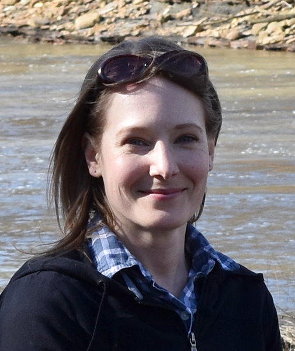

## Molly

{: .w-50 .ml-3 .img-thumbnail .float-right}
Molly Thompson is a board certified medical illustrator, substitute teacher and traditional Irish fiddler living in western Pennsylvania. Her personal artwork reflects her interests in science, poetry, education, the human figure and emotional expression through mark making, often with animals as subjects.

## Artist Statement
{: .clear-fix}

This is a place for my personal art.

My commercial (commissioned) art involves much research, communication and problem-solving. There are rules. There are translations. There are educational goals. I love my job, but there is still a person behind the professional, and my own art can be anything I want it to be. That’s as liberating for me as it should be for anyone. Like journaling in a notebook, practicing musical scales or physically exercising, art is a psychomotor activity that almost everyone can benefit from if they allow themselves to do it and refrain from judging the end result. 

At my best, I carve out enough time for drawing, writing and music, even when it seems easier to just consume information or more acceptable to participate in activities that some would say are more productive (or sociable). The battle for balance is an ongoing effort, and this is true for every artist I know. I try to look at my personal art as meditation or practice, and what I end up making doesn’t really matter: what matters is that I gave myself the time and space to explore an idea, work through an emotion, learn something new, or just escape for a while.
